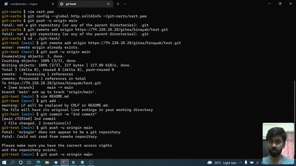

<div id="top"></div>

<!-- PROJECT LOGO -->
<br />
<div align="center">
    
    &nbsp;
    
    &nbsp;
    
  <h3 align="center">Self Hosted Version Control with Gitea</h3>
</div>


<!-- ABOUT THE PROJECT -->
## About



This repository contains `docker-compose.yml` files used for setting up a self hosted version control server with the official [Gitea Image](https://hub.docker.com/r/gitea/gitea). The Video tutorial for the same can be found [here]()

### Built With

* [Docker](https://docs.docker.com/)
* [Gitea](https://docs.gitea.io/en-us/)
* [Nginx](https://docs.nginx.com/)

<!-- Contents -->
## Table of Contents

- [Getting Started](#getting-started)
- [Docker Commands](#basic-docker-commands)
- [Docker Compose](#onward-with-docker-compose)
- [Firewall and iptables](#firewall-and-iptables)


<!-- GETTING STARTED -->
## Getting Started

Lets get started

### Installing Docker on Ubuntu


```sh
$ sudo apt-get remove docker docker-engine docker.io containerd runc

$ sudo apt-get update

$ apt-get install ca-certificates curl gnupg lsb-release

$ sudo mkdir -p /etc/apt/keyrings

$ curl -fsSL https://download.docker.com/linux/ubuntu/gpg | sudo gpg --dearmor -o /etc/apt/keyrings/docker.gpg
 
$ echo "deb [arch=$(dpkg --print-architecture) signed-by=/etc/apt/keyrings/docker.gpg] https://download.docker.com/linux/ubuntu \
$(lsb_release -cs) stable" | sudo tee /etc/apt/sources.list.d/docker.list > /dev/null

$ sudo apt-get update

$ sudo apt-get install docker-ce docker-ce-cli containerd.io docker-compose-plugin docker-compose
```

Verify the installation using

```sh
$ docker --version

$ docker-compose --version
```

### Adding Aliases in `.bashrc` (Optional)

Open the `.bashrc` file using 
```sh
$ vim ~/.bashrc
```

Add the following lines at the end and save it
```sh
# Docker Aliases
alias d='docker'
alias dc='docker-compose'
alias dcu='docker-compose up -d --force-recreate'
alias dcl='docker-compose logs -f'
```

Re-read the file for changes to take effect
```sh
$ source ~/.bashrc
```

Verify 
```sh
$ d --version

$ dc --version
```

<p align="right">(<a href="#top">back to top</a>)</p>

<!-- Basic commands -->
## Basic Docker Commands

### Start an nginx container
```sh
$ docker run -p 80:80 -d nginx
```

> or `d run -p 80:80 -d nginx`.
> This will pull the latest `nginx` image from docker hub (if it doesn't exist locally), start a container and map port 80 of the container to port 80 of the host machine (if it is free)

### Verify whether the service is running

- List the running containers 

    ```sh
    $ docker ps
    ```
    > `docker ps -a` will list all the containers in the host machine regradless of them being stopped or running
     
- Fetch the page 
    ```sh
    $ curl localhost:80
    ```

### Stopping containers
```sh
$ docker stop <CONTAINER_ID>
```
> or `d stop <CONTAINER_ID>`

### Removing containers 
```sh
$ docker rm <CONTAINER_ID>
```
> or `d rm <CONTAINER_ID>`

### List docker networks
```sh
$ d network ls
```

<p align="right">(<a href="#top">back to top</a>)</p>

<!-- Docker Compose -->
## Onward with Docker Compose

### Create directories for different stacks

```sh
$ mkdir -p ~/nginx/ssl
$ mkdir ~/db
$ mkdir ~/gitea
```

### Self signed SSL certificates using `openssl`
```sh
$ openssl req -newkey rsa:2048 -nodes -days 365 -x509 \
-keyout ~/nginx/ssl/key.pem -out ~/nginx/ssl/cert.pem
```

### Configuring Nginx
```sh
$ vim ~/nginx/docker-compose.yml
```

[Nginx `docker-compose.yml`]()

- Running the stack
```sh
$ cd ~/nginx/
$ dcu
```
- Verify 
```sh
$ dc ps
$ curl localhost:<HOST_PORT>
```

- Stopping the stack
```sh
$ dc down
```

- Add the `default.conf` file
```sh
$ vim ~/nginx/nginx/conf.d/default.conf 
```
[default.conf]()

### Configuring MySql and phpMyAdmin 
- Add a backend network
```sh
$ d network create backend
```
- Add the `docker-compose.yml` file
```sh
$ vim ~/db/docker-compose.yml
```
[Database `docker-compose.yml`]()

- Start the stack
```sh
$ cd ~/db/
$ dcu
```
- Verify 
```sh
$ dc ps
$ curl localhost:<HOST_PORT>
```
> Add a user and database in mysql using phpmyadmin which can be used by Gitea

### Configuring Gitea
```sh
$ vim ~/gitea/docker-compose.yml
```
[Gitea `docker-compose.yml`]()

- Start the stack
```sh
$ cd ~/gitea/
$ dcu
```
- Verify 
```sh
$ dc ps
$ curl localhost:<HOST_PORT>
```
> Go to the page and install gitea using the webUI

- Modify the `app.ini` file and change `ROOT_URL`
```sh
$ vim vim ~/gitea/gitea/gitea/conf/app.ini
```
[Gitea `app.ini`]()

- Restart the stack
```sh
$ dcu
```

<p align="right">(<a href="#top">back to top</a>)</p>

## Firewall and iptables

### Write custom rules for `ufw`
```sh
$ ufw default deny incoming
$ ufw default allow outgoing
$ ufw allow 22
$ ufw allow 80
$ ufw allow 443
```
- Check added rules
```sh
$ ufw show added
```

- Enable the firewall
```sh
$ ufw enable
```

> Check firewall status using `ufw status`

### Modify `DOCKER-USER` chain in `iptables`
- Check existing rules 
```sh
$ iptables -L DOCKER-USER
```

- Block all incoming connections if not from a specific source
```sh
$ iptables -I DOCKER-USER -i <EXTERNAL_INTERFACE> ! -s <SOURCE_IP> -j DROP
```
> Check `EXTERNAL_INTERFACE` and `SOURCE_IP` using `ip addr` 

[Docker and iptables](https://docs.docker.com/network/iptables/)

- Verify the change
```sh
$ iptables -L DOCKER-USER
```
> The preference order for rules specified in `iptables` is top-down, so the rules specified above, will have higher preference

<p align="right">(<a href="#top">back to top</a>)</p>

<!-- REFERENCE -->
## Video Tutorial

[NoobDev EP03 | Exploring Docker | Self Hosted Version Control with Gitea | Nginx as Reverse Proxy | Docker and iptables]()